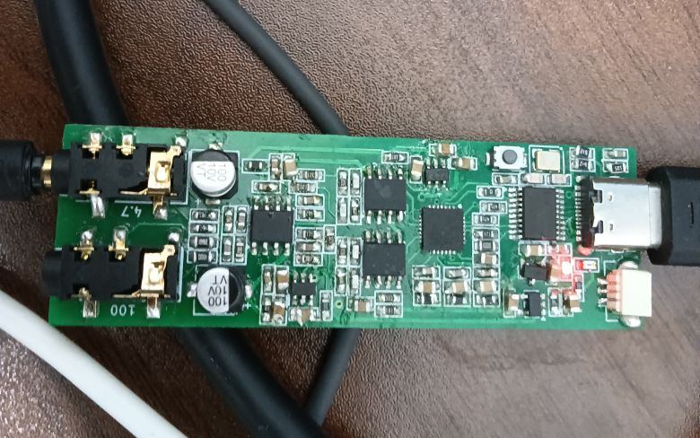

# CH32V305-UAC2
a usb-hs uac2 dac

> [!NOTE]
> ch32v305fbp6 doesn't have OTG-HS(but it has OTG-FS), so you can't connect this project to a smartphone.  

## hardware v1
ch32v305fbp6 + es9018k2m + opa1678  

## hardware v2
ch32v305fbp6 + es9018k2m + opa1678 + sgm8262  
> [!NOTE]
> you may want to change all the 10uf capacity footprint to 0805, because 0603 10uf may only have 10v version  
> and you may want to add more capacity for charge pump  

## notice

Due to using inexpensive components, the clock has approximately a 200 Hz error. Additionally, the MCLK GPIO speed exceeds the maximum 50 MHz limit at 192 kHz.  
If desired, you can use an external crystal for the I2S MCLK clock.  
This dac only support 48k,96k,192k 32bits, dsd and other formats are not considered.  
This DAC only supports high-speed connections.  
You might hear some popping sounds during sudden high-load tasks. 

## setup
Just flash HSDAC.elf to hardware. Don't use HID-Bootloader and dfu, they will be redoing in future.  

## help wanted
Can someone redesign the power amplifier circuit?  

# IMAGE

